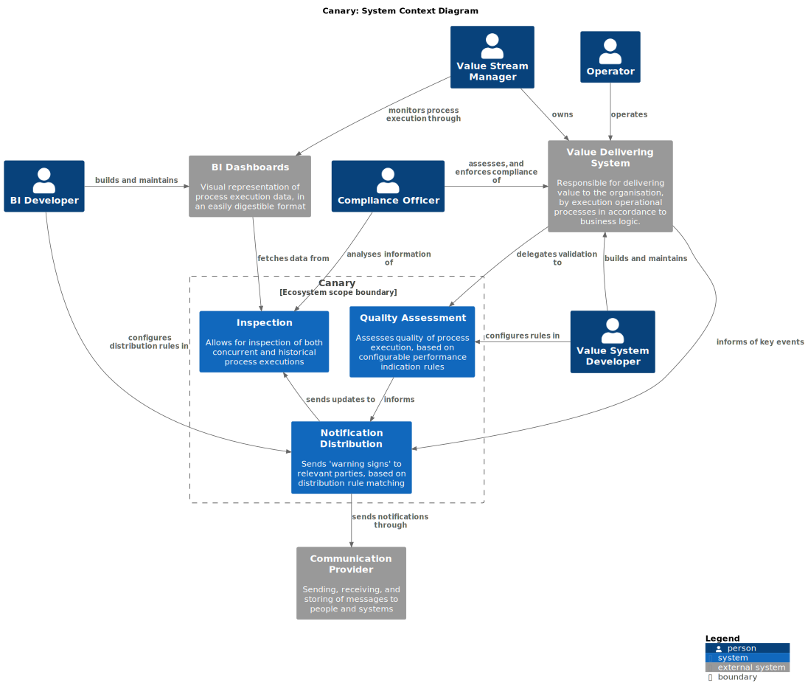

# Canary: Early Warning System for Process Quality

Organizations across industries are increasingly challenged by the late detection of operational issues, leading to exponentially higher costs when problems eventually surface in production. This challenge is compounded by the inherent complexity of modern software ecosystems—where legacy systems coexist with newer technologies -- and the pressure to deliver software faster and more economically. 

In many cases, organizations struggle to implement consistent, scalable monitoring solutions due to the diverse and evolving nature of their technological landscapes. Additionally, stringent legislative and regulatory requirements, especially in sectors like finance and healthcare, demand robust compliance and risk mitigation measures. 

The Canary Platform is conceived as a modular, scalable early warning system designed to seamlessly integrate with existing architectures. By shifting critical monitoring tasks _“left”_ in the operational process, Canary aims to detect potential issues early -- when they are simpler and more cost-effective to fix -- thus safeguarding operational integrity, reducing economic risk, and ensuring compliance with regulatory standards.

## Business Context

### Problem Statement

* Many organisations struggle with operational issues caused by late detection of problems in their processes.
  * The cost of fixing issues increases exponentially the later they are detected.
* Many organisations struggle with the complexity of their software systems.
  * Inherent complexity of the problem domain makes it challenging for teams to understand the system as a whole.
  * A mix between older and newer technologies makes it hard to implement a consistent monitoring solution.
* Economic pressure to deliver software faster and cheaper has a trickle-down effect on the quality of the software.
  * This leads to a higher number of defects in production, which in turn leads to higher operational costs.
  * Development teams are unlikely to take the time to implement monitoring solutions due to feature pressure.
* Legislative requirements are becoming more stringent, requiring organisations to have a better understanding of their systems.
  * This is especially true in the financial and healthcare sectors, where the cost of non-compliance is high.
  * Compliance is often achieved through manual processes, which are error-prone, slow, and difficult to scale. 

> TODO: Add Causal loop diagram to illustrate the problem statement

### Unique Value Proposition

* Focus on ease-of-integration with existing systems.
  * Modular architecture allows for easy integration with existing systems.
  * Use of a domain-specific language to define rules and actions.
  * Use of a template-based approach to generate code for different languages and platforms.
* Shift monitoring tasks "left" in the operational process.
  * Detect potential issues early, when they are simpler and more cost-effective to fix.
  * Safeguard operational integrity, reduce economic risk, and ensure compliance with regulatory standards.
* Keep the business-value systems in control of their own domain and rules.
  * Provide a rule engine that can execute custom rules defined by the client.
  * Use a plugin architecture to allow for easy extension of the rule engine.
  * Supply domain agnostic communication libraries to allow for easy integration with existing systems.

## Architecture Overview

### System Context

The diagram below shows the high-level system context for the canary platform. It illustrates the key components and their interactions with external systems, as well as the primary stakeholders involved in the system.

### Key Components

#### Notable External Systems

This section describes the key external systems that interact with the Canary Platform, as well as the nature of their interactions. These systems are essential for the operation of the Canary Platform and provide critical data and functionality. The interactions with these systems are described in more detail in sections pertaining to Key Interactions, and Process Flow descriptions.

##### Communication Provider

Sending, receiving, and storing of messages to people and systems

##### BI Dashboards

Visual representation of process execution data, in an easily digestible format

##### Value Delivering System

Responsible for delivering value to the organisation, by execution operational processes in accordance to business logic.

#### Canary Platform Components

The key components of the Canary Platform are described below, along with their primary responsibilities and interactions with other components. These are further detailed and decomposed in their respective Domain Descriptions.

### Key Design Ideas

* Maximize modularity to allow for easy integration with existing systems.
  * Use an event-based interaction model to allow for decoupled components and easy extensibility.
  * Create core libraries that can be used to build custom rules and actions.
  * Use a ports-and-adapters architecture to allow for easy integration with different systems.
* Leverage automated code-generation tools to reduce the time and effort required to create new integrations.
  * Use a domain-specific language to define rules and actions.
  * Use a template-based approach to generate code for different languages and platforms.
  * Define APIs for common integration points, using the OPEN API specification.
  * Use a GraphQL-based query language to allow for flexible data retrieval.
* Use client-defined rules to allow for easy customization and extensibility.
  * Provide a rule engine that can execute custom rules defined by the client.
  * Use a plugin architecture to allow for easy extension of the rule engine.
* Reuse existing solutions in the organization to reduce the time and effort required to implement the system, and allow teams to onboard Canary transparently.
  * Use existing monitoring solutions to collect data.
  * Use existing alerting systems and communication tools to notify users of issues.
  * Use existing logging and tracing solutions to track the flow of data through the system.
* Use a container-based deployment model to allow for easy scaling and management of the system.